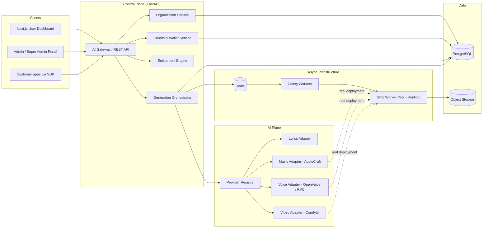
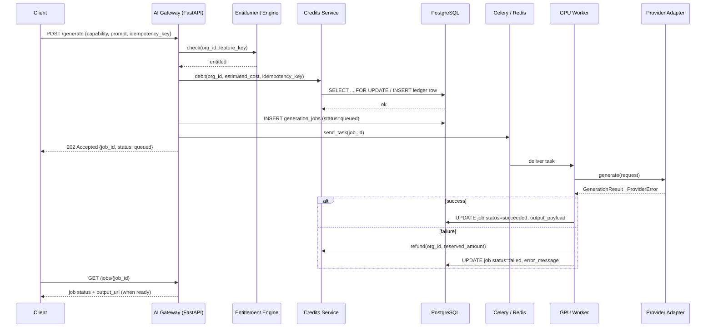

# Architecture Overview

## Goals

The platform is designed around seven non-negotiable properties (see the
project brief): **provider independent, model agnostic, multi-tenant,
white-label ready, enterprise ready, scalable, secure.** Every architectural
decision below exists to serve one or more of these.

## High-level component diagram

## Request lifecycle: a single generation job

## Why an Adapter Pattern for AI providers

Business logic (`app.services`, `app.api`) never imports `audiocraft`,
`openvoice`, `rvc` or `comfyui` packages directly. It only knows the
`AIProviderAdapter` protocol defined in `app/providers/base.py`. Concrete
adapters live in `app/providers/{lyrics,music,voice,video}/` and are wired
up in `app/providers/registry.py`.

Consequences:

- Adding a new provider (a commercial API, a newer open-source model) is a
  new adapter class plus one line in the registry -- no change to services,
  routers, or the job schema.
- A/B testing two providers for the same capability, or offering
  enterprise customers a choice of provider, is a `provider_name` field on
  the request, not a code branch.
- The reference adapters shipped in this repository (see each module's
  docstring) simulate GPU latency and output shape so the full
  credits → entitlement → job → webhook pipeline is exercisable and
  testable without a GPU; swapping in real inference is intentionally
  isolated to those files.

## Multi-tenancy

Row-level multi-tenancy: every tenant-owned table carries an
`organization_id` foreign key, and the repository layer is the only place
allowed to query these tables -- every query filters by tenant. See
[`docs/adr/0002-multi-tenancy-strategy.md`](./adr/0002-multi-tenancy-strategy.md)
for the tradeoffs against schema-per-tenant and database-per-tenant, and
when the platform would need to graduate to one of those for very large
enterprise customers.

## White-label

An `Organization` can set `is_white_label=True`, a `custom_domain`, and a
`branding` JSON blob (logo, colors, product name). `TenantResolutionMiddleware`
resolves incoming requests by `Host` header to the right organization so a
white-labeled customer's own domain transparently serves the same API and
(via the Next.js frontend, out of scope for this repository) the same
dashboard with their branding.

## Credits & billing

See [`docs/adr/0001-provider-adapter-pattern.md`](./adr/0001-provider-adapter-pattern.md)
for the adapter pattern rationale and
[`app/services/credits_service.py`](../app/services/credits_service.py)
for the ledger implementation: every balance change is an idempotent,
append-only `CreditTransaction` row, and `Wallet.balance` is a cached
projection that is only ever mutated in the same DB transaction as its
ledger entry.

## Background AI Job Processing

Celery + Redis, with one queue per GPU-bound capability
(`gpu.music`, `gpu.voice`, `gpu.video`) plus a lightweight `lyrics` queue
that can run on CPU-only workers. `worker_prefetch_multiplier=1` and
`task_acks_late=True` are set so a crashed GPU worker's in-flight job is
requeued rather than lost. See `app/core/celery_app.py`.

## Developer Platform / SDK

`sdk/python/` ships a minimal, dependency-light client (`PlatformClient`)
that wraps the REST API. The same request/response contracts back
generated SDKs in other languages in a production rollout (TypeScript,
Go), since the API is the single source of truth.
