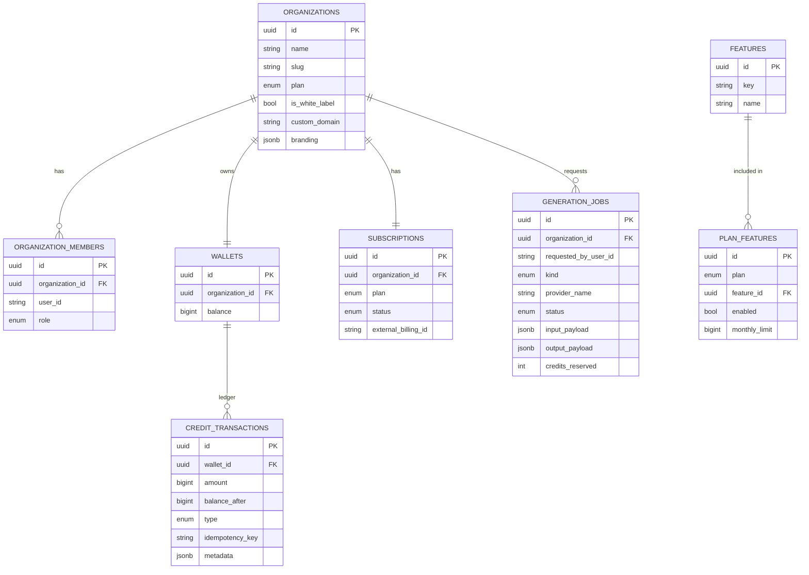

# Database Schema

PostgreSQL in production; the same SQLAlchemy models compile against
SQLite for the test suite (see `app/models/types.py`).

## Notes

- **`credit_transactions` is append-only.** No code path ever `UPDATE`s or
  `DELETE`s a row here; corrections are new rows (`REFUND`,
  `ADMIN_ADJUSTMENT`). This is what makes the ledger auditable.
- **`(wallet_id, idempotency_key)` is a unique constraint**, not just an
  application-level check -- it is the mechanism that makes
  `CreditsService.debit`/`credit` safe to retry.
- **`plan_features` is data, not code.** Changing what the `pro` plan
  includes is a row insert, not a deploy. See
  [`scripts/seed_demo_data.py`](../scripts/seed_demo_data.py) for the
  starter data set.
- Migrations are managed with Alembic (`migrations/`); see
  [`migrations/versions/0001_initial_schema.py`](../migrations/versions/0001_initial_schema.py)
  for the full column-level definition of every table above.
